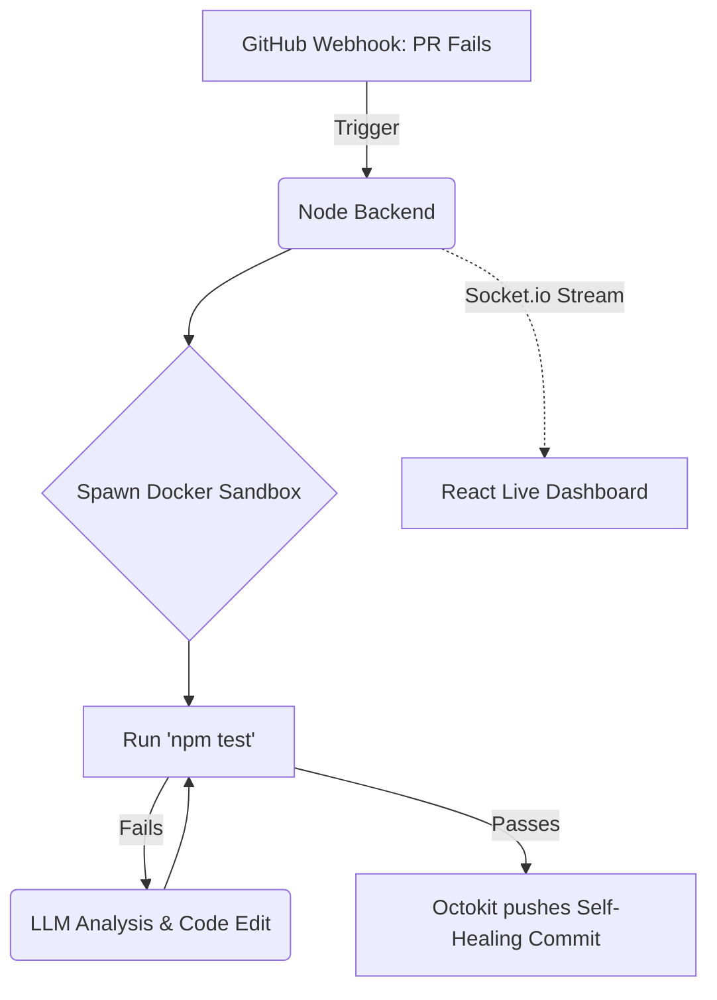

<div align="center">
  

  # Ghostwriter Agent 🤖
  
  **An autonomous, self-healing CI/CD agent that detects, analyzes, and fixes failing Pull Requests using MERN, Docker, and LLM-based reasoning.**

  <p align="center">
    <a href="https://github.com/md-bilal-d/ghostwriter-agent/stargazers"></a>
    <a href="https://github.com/md-bilal-d/ghostwriter-agent/issues"></a>
    <a href="https://github.com/md-bilal-d/ghostwriter-agent/pulls"></a>
    
  </p>
</div>

<br>

## 📖 Overview
Ghostwriter isn't just a chatbot; it's a **digital teammate**. It monitors your GitHub repository for new Pull Requests. If the CI/CD pipeline fails, the Agent:
1. **Clones** the branch into a secure Docker sandbox.
2. **Analyzes** the test logs to find the root cause.
3. **Proposes and validates** a code fix.
4. **Pushes** a "Self-Healing" commit or opens a refined Pull Request.

In traditional development, a failing test causes a massive "context switch" for humans. Developers stop what they are doing, read logs, fix typos, and wait for another review. **Ghostwriter** handles this automatically, acting as a Level 3 Autonomous Agent.

---

## ✨ Features

- 🧠 **Agentic Reasoning:** Uses Chain-of-Thought prompting to determine exactly which files to edit based on semantic analysis.
- 🛡️ **Zero-Trust Security:** All AI-generated code is executed in an isolated, ephemeral Docker container, protecting the host system from prompt injection or malicious code.
- 🛠️ **Automated Recovery:** Automatically patches common trivial bugs like syntax errors, missing null pointer checks, and dependency mismatches.
- 📺 **Live Monitoring Dashboard:** A sleek React dashboard that streams the agent’s terminal output in real-time via WebSockets.
- ✅ **Human-in-the-Loop:** Operates with bounded autonomy. It pushes fixed branches or submits PR reviews rather than deploying directly to production.

---

## 🏗️ Architecture & Tech Stack

| Layer | Technologies |
| :--- | :--- |
| **Frontend** | React.js 18, Vite, Tailwind CSS, Socket.io-client |
| **Backend** | Node.js, Express, MongoDB (Mongoose), Socket.io |
| **DevOps** | Docker, Octokit (GitHub API), smee.io (Webhooks) |
| **AI Engine** | LangGraph, Google Gemini 1.5 Pro / OpenAI GPT-4o |

---

## ⚙️ How It Works (The Agentic Loop)



---

## 🚀 Setup & Installation

### Prerequisites
- **Node.js**: v18+
- **Docker**: Docker Desktop or Engine running locally.
- **GitHub**: A GitHub Personal Access Token (`GITHUB_TOKEN`) with repo scope.
- **AI API Key**: `OPENAI_API_KEY` or `GEMINI_API_KEY`.

### Quick Start Guide

1. **Clone the repository:**
   ```bash
   git clone https://github.com/md-bilal-d/ghostwriter-agent.git
   cd "Ghostwriter Agent"
   ```

2. **Backend Setup:**
   ```bash
   cd backend
   npm install
   cp .env.example .env
   ```
   *Edit the `.env` file to include your database URI and API keys.*
   ```bash
   npm run dev
   ```

3. **Frontend Setup:**
   Open a new terminal session.
   ```bash
   cd frontend
   npm install
   npm run dev
   ```

4. **Access the Dashboard:**
   Visit `http://localhost:5173` to see the Live Stream command center!

---

## 🛡️ Security Note
Ghostwriter adheres strictly to a **Zero-Trust architecture**. The primary Node host MUST NOT execute untrusted codebase code. All repository analysis, dependency installation (`npm i`), and testing (`npm test`) happens uniquely inside isolated Docker containers. 

---

<div align="center">
  Built following <strong>AgenticCI Framework</strong> principles.
</div>
